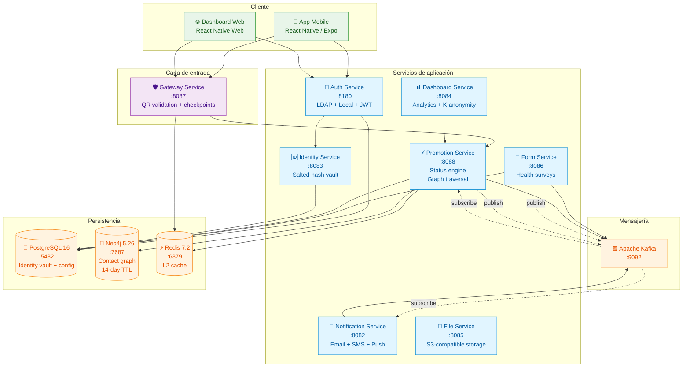
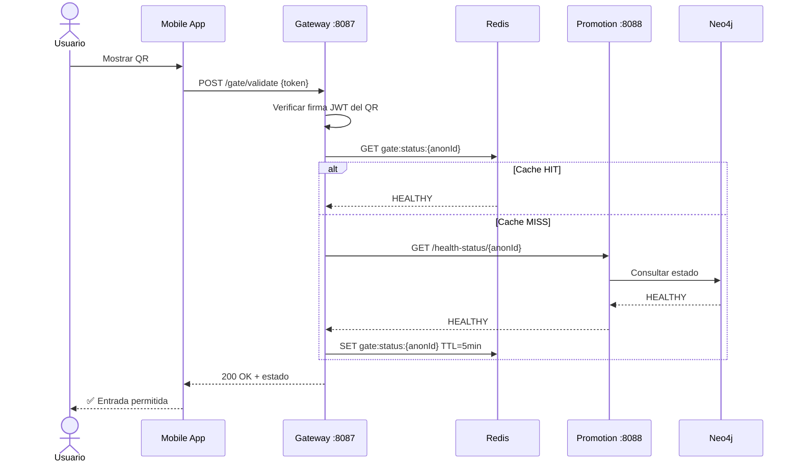
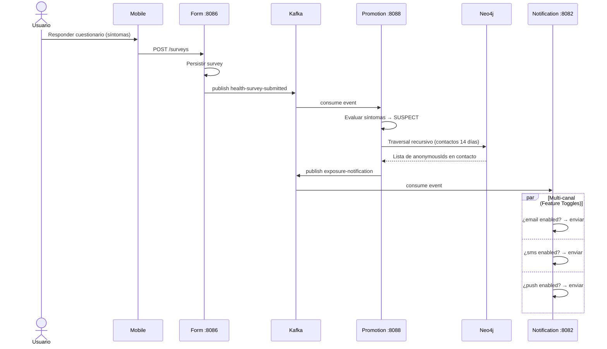
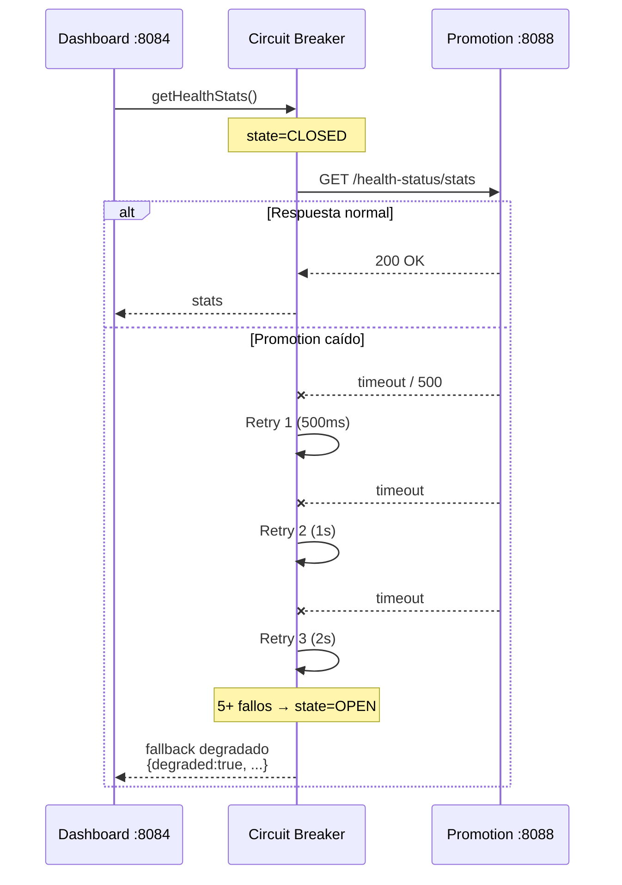
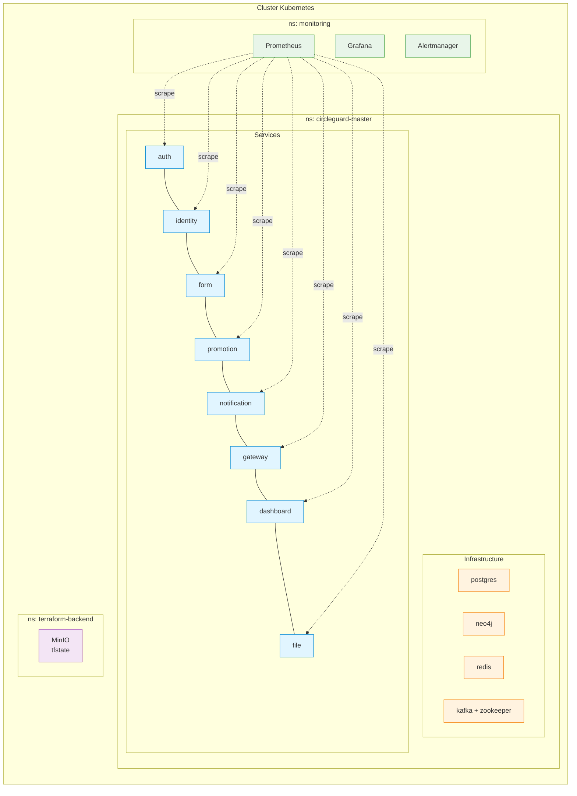

# Arquitectura del Sistema — CircleGuard

> Documento del **Requisito 9 — Documentación** del Proyecto Final IngeSoft V.
> Vista detallada de la arquitectura, flujos de datos e integraciones del sistema.

---

## 1. Vista de alto nivel

CircleGuard es una arquitectura de **microservicios event-driven** con un **modelo híbrido de datos** (grafo + relacional + caché). Privacidad por diseño: las identidades reales solo viven en una bóveda aislada, y todo el resto del sistema opera con identificadores anónimos.



---

## 2. Catálogo de servicios

| Servicio | Puerto | Responsabilidad | Almacenes |
|---|---:|---|---|
| **Gateway Service** | 8087 | Validación de QR firmados, checkpoint de entrada al campus, rate limiting. | Redis (caché L2 de estados de salud) |
| **Auth Service** | 8180 | Doble cadena de autenticación: LDAP (universidad) + Local (visitantes). Emite JWT. | PostgreSQL (usuarios locales), LDAP (universitarios) |
| **Identity Service** | 8083 | Bóveda de identidad: convierte `realIdentity` (cédula/email) en `anonymousId` (UUID). Único componente con acceso al mapeo real. | PostgreSQL (`identity_mapping`, encriptado en reposo) |
| **Form Service** | 8086 | Cuestionarios dinámicos de salud + envío de surveys. Publica `health-survey-submitted` events. | PostgreSQL (questionnaires, surveys) |
| **Promotion Service** | 8088 | Motor del sistema: ingesta de surveys + análisis de contactos en grafo + promoción de estados (Suspect → Probable → Confirmed). | Neo4j (contact graph) + PostgreSQL (config) + Redis (caché) |
| **Notification Service** | 8082 | Despachador multi-canal con Feature Toggles. Consume eventos de exposición/alertas. | — (solo consume Kafka) |
| **Dashboard Service** | 8084 | Analytics agregados con K-anonymity para preservar privacidad. Llama a Promotion vía REST con Circuit Breaker. | — (delega a Promotion) |
| **File Service** | 8085 | Almacenamiento de certificados médicos y documentos. | MinIO / S3 |

---

## 3. Modelo de datos híbrido

### 3.1 PostgreSQL — datos transaccionales y de identidad

```
┌────────────────────────────────────┐
│        circleguard_auth            │
│  - local_users                     │
│  - roles, permissions              │
├────────────────────────────────────┤
│        circleguard_identity        │
│  - identity_mapping                │
│    (real_identity_encrypted,       │
│     anonymous_id UUID)             │
├────────────────────────────────────┤
│        circleguard_form            │
│  - questionnaires                  │
│  - questions                       │
│  - health_surveys                  │
├────────────────────────────────────┤
│        circleguard_promotion       │
│  - access_points                   │
│  - buildings, floors               │
│  - system_settings                 │
└────────────────────────────────────┘
```

### 3.2 Neo4j — grafo de contactos

Nodos: `(:User {anonymousId})`, `(:Circle)`
Aristas: `(:User)-[:ENCOUNTERED {timestamp, location}]->(:User)` con **TTL automático de 14 días**.

Consulta clave (promoción recursiva de Suspect):
```cypher
MATCH (origin:User {anonymousId: $sourceId})
MATCH path = (origin)-[:ENCOUNTERED*1..3]-(contact:User)
WHERE all(r IN relationships(path) WHERE r.timestamp > datetime() - duration('P14D'))
RETURN DISTINCT contact.anonymousId
```

### 3.3 Redis — caché L2

| Key pattern | TTL | Propósito |
|---|---|---|
| `gate:status:{anonymousId}` | 5 min | Cache de estado de salud para validación de QR (evita ir a Promotion en cada check-in) |
| `gate:rate:{userId}` | 1 min | Rate limiting |

---

## 4. Flujos críticos

### 4.1 Flujo de entrada al campus (lectura)



### 4.2 Flujo de promoción de estado (escritura event-driven)



### 4.3 Patrón de resiliencia — Dashboard → Promotion



Implementación: ver [`PATRONES_DE_DISENO.md`](PATRONES_DE_DISENO.md).

---

## 5. Topología de despliegue (Kubernetes)



| Namespace | Componentes | Provisionado por |
|---|---|---|
| `circleguard-dev` / `-stage` / `-master` | 8 microservicios + Postgres + Neo4j + Redis + Kafka + Zookeeper | [Terraform](../terraform/) |
| `monitoring` | Prometheus + Grafana + Alertmanager + kube-state-metrics | [Helm chart](../observability/install-monitoring.sh) |
| `terraform-backend` | MinIO + PVC + bucket `terraform-state` | [`terraform/global/backend-bootstrap/`](../terraform/global/backend-bootstrap/) |

---

## 6. Stack tecnológico

| Capa | Tecnología | Versión | Justificación |
|---|---|---|---|
| Backend | Spring Boot + Java | 3.2.4 + 21 | Maduro, low-latency Jakarta EE |
| Build | Gradle + Kotlin DSL | 8.14 | Builds paralelos multi-módulo |
| Grafo | Neo4j | 5.26 | Traversals recursivos imposibles con SQL |
| Relacional | PostgreSQL | 16 | ACID para identidad + config |
| Cache | Redis | 7.2 | L2 distribuido < 1ms |
| Mensajería | Apache Kafka + Zookeeper | 7.6 (Confluent) | Audit-trail persistente de eventos |
| Resiliencia | Resilience4j | 2.2.0 | Circuit Breaker + Retry declarativo |
| Mobile/Web | Expo (React Native) | latest | Codebase único iOS/Android/Web |
| Orquestación | Kubernetes | 1.31 | HA + auto-scaling |
| IaC | Terraform | 1.6.0+ | Multi-ambiente reproducible |
| CI/CD | Jenkins | LTS 2.426+ | Pipelines declarativos + agents |
| Observability | Prometheus + Grafana | 2.55 + 11.3 | Métricas + dashboards |
| Security | Trivy + OWASP ZAP | 0.70 + stable | Container + DAST |
| Quality | SonarQube + JaCoCo | LTS + 0.8.11 | Análisis estático + coverage |

---

## 7. Decisiones arquitectónicas clave (ADRs)

| ID | Decisión | Tradeoff |
|---|---|---|
| ADR-01 | **Modelo de datos híbrido (Neo4j + PostgreSQL)** | Más complejidad operativa vs. consultas de contacto 100x más rápidas que SQL recursivo |
| ADR-02 | **Event-driven con Kafka** (no REST entre form↔promotion↔notification) | Más infra vs. acoplamiento débil, audit trail y resiliencia a caídas |
| ADR-03 | **Bóveda de identidad separada** (Identity Service aislado) | Service extra vs. único componente con datos personales — facilita auditoría FERPA |
| ADR-04 | **Spring Boot 3.2 sobre Boot 4** | Boot 4 todavía no LTS estable; 3.2 cubre nuestras necesidades |
| ADR-05 | **JaCoCo + JUnit + Testcontainers** sobre Pact | Suficiente para contract tests internos; Pact agregaría complejidad sin valor adicional |
| ADR-06 | **Resilience4j sobre Spring Retry solo** | Spring Retry no tiene Circuit Breaker — pedido explícito del Req. 3 |
| ADR-07 | **MinIO como backend Terraform** (no S3 real) | Costo cero local vs. menos producción-realista — aceptado para entorno académico |

---

## 8. Próximos pasos arquitectónicos (no-MVP)

- Migrar a **Service Mesh** (Istio/Linkerd) para mTLS + traffic shifting.
- **ELK / Loki** para gestión de logs centralizada (actualmente solo `kubectl logs`).
- **Jaeger / Tempo** para tracing distribuido (actualmente solo métricas).
- **Multi-cloud** activo-pasivo entre GCP y AWS.
- **Chaos engineering** con Chaos Mesh / Litmus.
